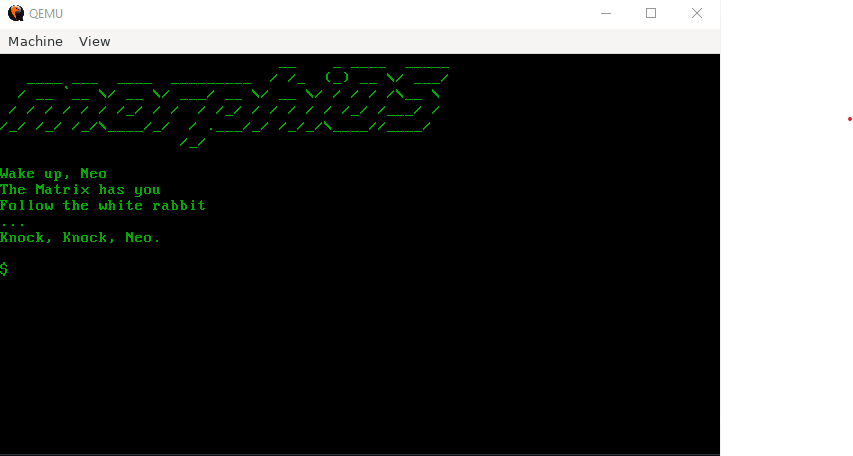

# MorphiOS

```
                               __    _ ____  _____
   ____ ___  ____  _________  / /_  (_) __ \/ ___/
  / __ `__ \/ __ \/ ___/ __ \/ __ \/ / / / /\__ \
 / / / / / / /_/ / /  / /_/ / / / / / /_/ /___/ / 
/_/ /_/ /_/\____/_/  / .___/_/ /_/_/\____//____/  
                    /_/                           

Wake up, Neo
The Matrix has you
Follow the white rabbit
...
Knock, Knock, Neo.
```

MorphiOS is a lightweight 32-bit operating system written in C++ for the i386 (x86) architecture.

Currently supported features:
 - Kernel (interfaced with the GRUB bootloader)
 - Hardware communication (I/O ports)
 - Global Descriptor table (GDT)
 - Interrupts and interrupt handlers
 - Drivers for VGA graphics, keyboard and mouse

Used the following learning resources: 
- https://wiki.osdev.org/
- http://wyoos.org/

## Installation

### Dependencies

#### Essential:

- [make](https://www.gnu.org/software/make/)
- Host OS: Linux. Development has been done on [Windows Subsytem for Linux](https://docs.microsoft.com/en-us/windows/wsl/install-win10) on Windows 10 (Ubuntu 20.04.2 LTS). Or you can develop on Ubuntu or another Debian based OS.
- GCC cross compiler for ```i686-elf``` targets. Read [this tutorial](https://wiki.osdev.org/GCC_Cross-Compiler) for more info on how to do this. (```sudo apt install g++ binutils libc6-dev-i686```)
- GRUB (specfically GRUB2) bootloader (to invoke ```grub-mkrescue```). Comes with Linux or google how to install it.
- Xorriso, the .iso creation engine used by grub-mkrescue (```sudo apt install xorriso```).

#### Optional:

- Install [qemu](https://www.qemu.org/). Required for booting and testing the OS in a VM locally.


## Compiling morphiOS

Open ```Makefile``` and modify ```GCC_FOLDER``` to the directory of your g++ cross compiler.

Open a terminal and run:
- ```make install```


## Running morphiOS

You can run morphiOS locally using ```qemu```.
- ```make install```
- ```make run```



Or you can generate the ISO image and run it using Virtualbox.

## Cleaning the project

Open a terminal and run:
- ```make clean```

